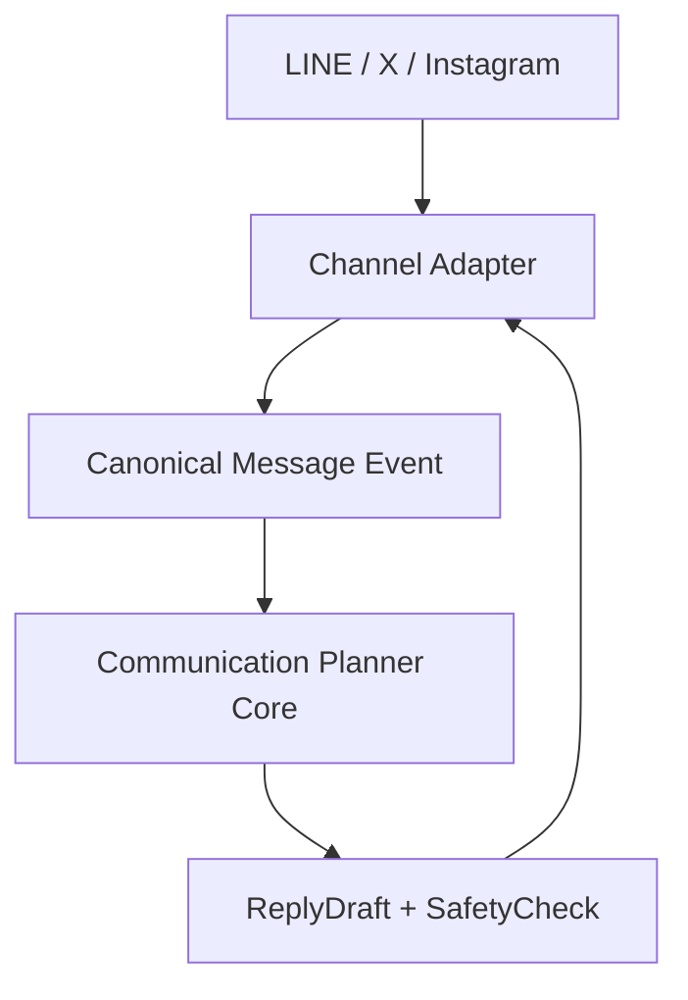

# Channel Adapter Strategy

Communication Planner will use the Harness OSS repositories as the primary references for channel adapter development.

Target repositories:

- `Shudesu/line-harness-oss`
- `Shudesu/x-harness-oss`
- `Shudesu/ig-harness-oss`

These repositories should be used for adapter architecture, webhook handling, identity mapping, and provider-specific message operations. Communication Planner must still own its core domain model and safety gates.

## Adapter Role

Channel adapters translate provider-specific events into Communication Planner's canonical model.

Adapters may handle:

- Provider webhook verification
- Provider event parsing
- Provider user/channel identity normalization
- Inbound message detection
- Outbound message delivery
- Provider message idempotency
- Provider API rate limit handling
- Adapter health checks
- Adapter integration state

Adapters must not own:

- CommunicationPerson as a business/customer master
- ConversationContext
- ReplyDraft
- SafetyCheck
- Final send decision
- Customer, Lead, Reservation, Payment, Sales, or Revenue

## Canonical Mapping

| Provider Concept | Communication Planner Concept |
| --- | --- |
| Provider account/channel | `ChannelAdapterState` |
| Provider user id | `ChannelIdentity.externalUserId` |
| Provider message id | `Message.externalMessageId` |
| Incoming text/media event | `Message` with `direction: inbound` |
| Outgoing sent result | `Message` with `direction: outbound` |
| Provider conversation/thread id | `Conversation.externalThreadId` when available |
| Linked provider identity | `communication.person_channel.linked.v1` |

## Required Event Outputs

Adapters must create or trigger these Communication Planner events:

| Situation | Event |
| --- | --- |
| Incoming provider message stored | `communication.message.received.v1` |
| Outgoing checked message sent | `communication.message.sent.v1` |
| Channel identity linked to person | `communication.person_channel.linked.v1` |
| Adapter updates context after message ingestion | `communication.context.updated.v1` |

## LINE Harness Usage

Use `Shudesu/line-harness-oss` for:

- LINE Official Account webhook flow
- LINE message event parsing
- LINE user identity handling
- LINE send API reference
- Cloudflare Workers + D1 deployment reference where useful

Communication Planner-specific additions:

- Map LINE user id to `ChannelIdentity`.
- Create or resolve `CommunicationPerson` projection before storing messages.
- Store inbound messages as Communication Planner `Message` records.
- Block outbound sends unless the related `ReplyDraft` has a passed and fresh `SafetyCheck`.

## X Harness Usage

Use `Shudesu/x-harness-oss` for:

- X account integration patterns
- DM and reply management patterns
- Provider identity and message history reference
- API usage and rate limit handling reference

Communication Planner-specific additions:

- Treat X identities as `ChannelIdentity` records.
- Avoid importing marketing automation, campaign gates, bulk actions, or follower growth concepts into core.
- Convert eligible DMs/replies into person-scoped `Conversation` and `Message` records.
- Route all outbound reply sends through the SafetyCheck send gate.

## IG Harness Usage

Use `Shudesu/ig-harness-oss` for:

- Instagram DM adapter patterns
- Instagram identity mapping
- DM send/receive flow reference
- Provider webhook/event handling reference

Communication Planner-specific additions:

- Treat Instagram profiles as `ChannelIdentity` records.
- Keep conversation context scoped to `workspaceId + personId`.
- Convert provider DM events into canonical `Message` records.
- Require SafetyCheck before send.

## Adapter Boundary

The adapter can send a message only after Communication Planner Core authorizes the send.

## Implementation Guardrails

- Provider webhook payloads should be normalized before reaching core services.
- Duplicate provider message ids must not create duplicate Message records.
- Store raw provider payloads only when needed for debugging or idempotency, and keep them out of reply generation context.
- Never use one person's context to generate another person's reply.
- Never allow bulk or broadcast sending through Communication Planner reply APIs.
- Every adapter operation should include `workspaceId`, `channel`, `traceId`, and `correlationId` when available.

## First Implementation Target

Implement adapter contracts before full provider integration:

1. Define `ChannelAdapter` interface.
2. Define provider-normalized inbound event shape.
3. Define provider-normalized outbound send request shape.
4. Add LINE adapter stub based on LINE Harness architecture.
5. Add X adapter stub based on X Harness architecture.
6. Add Instagram adapter stub based on IG Harness architecture.
7. Add tests proving outbound sends fail without SafetyCheck authorization.

## Implemented Webhook Entry Points

The MVP now exposes provider-specific webhook entry points:

| Channel | Endpoint | OSS reference |
| --- | --- | --- |
| LINE | `POST /api/adapters/line/webhook` | `Shudesu/line-harness-oss` |
| X | `POST /api/adapters/x/webhook` | `Shudesu/x-harness-oss` |
| Instagram | `POST /api/adapters/instagram/webhook` | `Shudesu/ig-harness-oss` |

Each endpoint accepts a harness-compatible JSON object and normalizes these provider concepts before core ingestion:

| Provider field family | Canonical field |
| --- | --- |
| `workspaceId`, `tenantId`, `teamId` | `workspaceId` |
| `externalUserId`, `userId`, `senderId`, nested sender/source id | `externalUserId` |
| `body`, `text`, `messageText`, nested message text | `body` |
| `eventId`, `messageId`, nested message id | `externalMessageId` |
| `threadId`, `conversationId`, `roomId`, `chatId` | `externalThreadId` |
| `displayName`, `senderName`, `username`, nested sender name | `displayName` |

The endpoints emit `communication.message.received.v1`. They do not perform provider send delivery; outbound provider delivery remains behind the ReplyDraft SafetyCheck gate.

## Implemented Send Adapter Flow

Outbound delivery now uses the `ChannelAdapter.send` contract after the API send gate passes.

Current production-safe behavior:

- `POST /api/reply-drafts/{replyDraftId}/send` still owns the final send decision.
- The route requires `workspaceId + personId + conversationId + channel`.
- The route resolves the original conversation and the matching `ChannelIdentity`.
- The route calls the channel adapter only after the latest SafetyCheck is passed and fresh.
- LINE, X, and Instagram adapters return `deliveryMode: "dry_run"` until production credentials and provider-specific delivery are configured.
- `ReplySendDecision.adapterDelivery` stores adapter reference, delivery mode, idempotency key, accepted flag, and provider/dry-run message id.
- `GET /api/adapters/readiness` reports whether each provider can move from requested live delivery to effective live delivery.
- If live delivery is requested but any credential, signature verification, rate-limit, or provider error mapping gate is missing, the effective adapter delivery mode remains `dry_run`.
- Webhook signature verification runs before normalization when `COMMUNICATION_PLANNER_WEBHOOK_SIGNATURE_VERIFICATION=enabled`.
- Provider send requests pass through the configured rate-limit policy before adapter delivery.
- Provider failures are mapped to stable Communication Planner codes such as `ADAPTER_AUTH_FAILED`, `ADAPTER_SIGNATURE_INVALID`, `ADAPTER_RATE_LIMITED`, and `ADAPTER_SEND_REJECTED`.

Harness references verified on 2026-08-17:

| Channel | Repository | Current adoption |
| --- | --- | --- |
| LINE | `Shudesu/line-harness-oss` | Primary send/receive adapter reference; dry-run send enabled |
| X | `Shudesu/x-harness-oss` | DM/reply adapter reference; dry-run send enabled, marketing automation excluded |
| Instagram | `Shudesu/ig-harness-oss` | DM adapter reference; dry-run send enabled |

Live provider sends must remain disabled until credentials, rate-limit handling, webhook signature checks, and provider-specific error mapping are added.

See [production-adapter-readiness.md](production-adapter-readiness.md) for the concrete environment gates and provider error mapping requirements.
